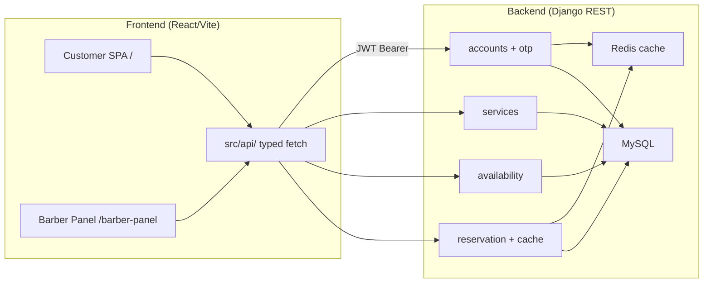

# AGENTS.md

Guidance for AI coding agents working in this repository.
Read this first — it explains the project so you don't need to read every file.

For the latest feature-by-feature implementation checklist, see [`IMPLEMENTATION_STATUS.md`](IMPLEMENTATION_STATUS.md).

## What this project is

The **frontend** for a barber-shop reservation system: a React + TypeScript single-page
app (Vite) that consumes a separate **Django REST API backend**. It's a Persian (Farsi),
right-to-left UI with two audiences in one SPA:

- **Customers** (`/`) browse barbers, pick a service/date/time, and book — authenticating
  with **phone + OTP** at checkout.
- **Barbers** (`/barber-panel`) log in with **phone + password**, and manage their
  services, weekly hours, date overrides, and appointments.

This repo is **frontend-only**. The backend lives in a separate project (the Django
`barber-reservation` repo). When a copy of the backend is checked out alongside, the API
contracts in `src/types/api.ts` are the source of truth for the integration.

## Tech stack

- React 18 + TypeScript 5 (**strict** mode; `noUnusedLocals`/`noUnusedParameters` on)
- Vite 5 (dev server, build, dev API proxy)
- React Router 6 (`BrowserRouter`)
- **No** Redux/Zustand/React Query, **no** axios, **no** UI kit. State is plain React
  Context + module-level stores; data fetching is a hand-rolled typed `fetch` wrapper;
  styling is global CSS.

## How to run things

```bash
npm install
cp .env.example .env        # set VITE_BACKEND_URL if backend isn't on http://localhost:8000
npm run dev                 # Vite dev server on :5173, proxies API to the backend
npm run build               # tsc --noEmit && vite build  → dist/
npm run typecheck           # tsc --noEmit only
npm run preview             # serve the production build
```

There is **no test runner and no ESLint config**. The type-checker is the only automated
gate — always finish a change with `npm run typecheck` (or `npm run build`) clean. Strict
mode means unused vars/params fail the build.

### Docker production build

```bash
docker build -t barber-frontend .
```

Multi-stage build: `node:20-alpine` builds, then `nginx:1.27-alpine` serves `dist/`.
`nginx.conf` proxies `/api`, `/auth`, `/admin/` to the backend container (same-origin).
`VITE_API_BASE` is intentionally empty in production.

## Architecture



Bootstrap chain (`src/main.tsx`): `BrowserRouter` → `AuthProvider` → `ToastProvider` → `App`.

## Directory map

| Path | What lives here |
|------|-----------------|
| `src/api/` | Typed `fetch` client (`client.ts`) + one module per backend resource (`auth`, `barbers`, `services`, `availability`, `reservations`), the `tokenStore`, and a barrel `index.ts`. |
| `src/types/api.ts` | TypeScript interfaces mirroring backend request/response shapes. The integration contract. |
| `src/context/` | `AuthContext` (session) and `ToastContext` (transient messages). |
| `src/hooks/` | Custom hooks, e.g. `useActiveBarbers`. |
| `src/components/` | Reusable UI: layouts (`CustomerLayout`), `ProtectedRoute`, cards, `BottomNav`, `Header`, `Avatar`, `Stars`, `BarberListItem`, `ServiceItem`, `TimeSelect`, `icons.tsx`. |
| `src/pages/` | Route components, split `customer/` and `barber/`. One file per screen. |
| `src/lib/` | Pure helpers: `dates.ts` (Jalali), `format.ts` (price + Persian digits), `timeGrid.ts` (30-min grid), `appointmentsStore.ts` & `demo.ts` (see gotchas). |
| `src/styles/` | `styles.css` (customer app) and `dashboard.css` (barber panel). Global, class-based. |
| `App.tsx` | The route table. |
| `main.tsx` | Bootstrap: providers + `App`. |

`@/` is an import alias for `src/` (set in `tsconfig.json` **and** `vite.config.ts` — keep
them in sync).

## Routes

| Path | Component | Audience | Protection / Layout |
|------|-----------|----------|---------------------|
| `/barber-panel/login` | `BarberLoginPage` | Barber | Public (redirects if already barber) |
| `/barber-panel` | `BarberDashboardLayout` | Barber | **Protected** `role="barber"` |
| `/barber-panel` (index) | → `/barber-panel/appointments` | Barber | Protected |
| `/barber-panel/appointments` | `BarberAppointmentsPage` | Barber | Protected |
| `/barber-panel/services` | `BarberServicesPage` | Barber | Protected |
| `/barber-panel/availability/weekly` | `WeeklyAvailabilityPage` | Barber | Protected |
| `/barber-panel/availability/dates` | `DateAvailabilityPage` | Barber | Protected |
| `/barber/:id` | `BarberDetailPage` | Customer | Public, standalone (own Header) |
| `/` | `HomePage` | Customer | Public, `CustomerLayout` |
| `/search` | `SearchPage` | Customer | Public, `CustomerLayout` |
| `/booking/:barberId` | `BookingPage` | Customer | Public, `CustomerLayout` |
| `/success` | `SuccessPage` | Customer | Public, `CustomerLayout` |
| `/appointments` | `AppointmentsPage` | Customer | Public page; content requires login |
| `/profile` | `ProfilePage` | Customer | Public (login form or account) |
| `*` | → `/` | — | Catch-all |

`ProtectedRoute` only guards the barber panel. Customer routes are public; auth is
enforced in-component where needed.

## How the frontend talks to the backend

All HTTP goes through `request<T>()` in [`src/api/client.ts`](src/api/client.ts). Never call
`fetch` directly from a component — add/extend a resource module under `src/api/` instead.

- **Base URL.** `request` prepends `API_BASE = import.meta.env.VITE_API_BASE ?? ''`. In dev
  it's empty, so paths are relative (`/api/...`) and the **Vite proxy** forwards them to
  `VITE_BACKEND_URL` (the backend has no CORS — the proxy is what avoids it). The proxied
  prefixes are defined in `vite.config.ts`: `/api`, `/auth`, `/availability`, `/admin`,
  `/static`. If you introduce a new top-level path prefix, add it to that proxy list.
- **Auth.** JWT (SimpleJWT). `tokenStore` ([`src/api/tokenStore.ts`](src/api/tokenStore.ts))
  persists `{ access, refresh, user }` in `localStorage` (`nobat.auth`) and notifies
  subscribers. A request opts into auth with `{ auth: true }`; the client adds the Bearer
  header, and on `401` refreshes the access token **once** via `/api/token/refresh/` (with
  a single in-flight refresh shared across callers) then retries. If refresh fails it
  clears the session.
- **Errors.** Non-2xx throws an `ApiError` (`status`, `payload`, and a human message).
  `extractErrorMessage` flattens DRF error bodies (`detail`, field arrays, nested objects)
  into one string. Catch `ApiError` when you need the status/field detail; otherwise show
  `err instanceof Error ? err.message : '…'`.
- Backend Swagger: `/api/docs/swagger/`.

### Two-experience auth

`AuthContext` derives `isCustomer` / `isBarber` from `user.role` (`'admin' | 'barber' |
'customer'`). Route guarding is done by [`ProtectedRoute`](src/components/ProtectedRoute.tsx)
(`<ProtectedRoute role="barber" redirectTo="/barber-panel/login" />`). Customer pages are
public; many work logged-out and only require auth at the booking step.

## API layer inventory

### `authApi` (`src/api/auth.ts`)

| Method | Endpoint | Auth |
|--------|----------|------|
| `barberRegister` | `POST /auth/barber/register/` | — |
| `barberLogin` | `POST /auth/barber/login/` | — |
| `customerRequestOtp` | `POST /auth/customer/request-otp/` | — |
| `customerVerifyOtp` | `POST /auth/customer/verify-otp/` | — |
| `logout` | `POST /auth/logout/` | yes |
| `getCustomerProfile` | `GET /auth/customer/profile/` | yes |
| `updateCustomerProfile` | `PATCH /auth/customer/profile/` | yes |

### `barbersApi` (`src/api/barbers.ts`)

| Method | Endpoint | Auth |
|--------|----------|------|
| `listActive` | `GET /api/barbers/` | — |
| `getBarber` | `GET /api/barbers/<id>/` | — |
| `publicServices` | `GET /api/services/barber-services/<id>/` | — |

### `servicesApi` (`src/api/services.ts`)

| Method | Endpoint | Auth |
|--------|----------|------|
| `list` | `GET /api/services/barber/` | yes |
| `create` | `POST /api/services/barber/` | yes |
| `update` | `PATCH /api/services/barber/<id>/` | yes |
| `remove` | `DELETE /api/services/barber/<id>/` | yes |

### `availabilityApi` (`src/api/availability.ts`)

| Method | Endpoint | Auth |
|--------|----------|------|
| `getWeekly` | `GET /api/availability/barber/weekly/` | yes |
| `saveWeekly` | `PATCH /api/availability/barber/weekly/` | yes |
| `listDates` | `GET /api/availability/barber/date/` | yes |
| `createDate` | `POST /api/availability/barber/date/` | yes |
| `deleteDate` | `DELETE /api/availability/barber/date/<id>/` | yes |

### `reservationsApi` (`src/api/reservations.ts`)

| Method | Endpoint | Auth |
|--------|----------|------|
| `availableSlots` | `GET /api/reservations/available-slots/` | — |
| `createAppointment` | `POST /api/reservations/appointments/` | yes |
| `myAppointments` | `GET /api/reservations/my-appointments/` | yes |
| `cancelAppointment` | `POST /api/reservations/my-appointments/<id>/cancel/` | yes |

### `tokenStore` (`src/api/tokenStore.ts`)

Module-level store persisting `{ access, refresh, user }` in `localStorage['nobat.auth']`.
Exposes `get`, `getAccess`, `getRefresh`, `set`, `setAccess`, `clear`, `subscribe`.

## Types (`src/types/api.ts`)

Key interfaces mirroring backend serializers:

- `Role`, `AuthUser`, `CustomerProfile`, `AuthTokenResponse`, `BarberRegisterResponse`
- `OTPRequestResponse` — includes `code` (returned in dev mode)
- `ActiveBarber` — `{ id, name }` (only real fields from API)
- `BarberDetail` — full profile with bio, phone, address, specialty, etc.
- `Service`, `PublicService` — `price` is **string** (DecimalField)
- `AvailableSlot`, `AvailableSlotsResponse`
- `AppointmentStatus` = `'p' | 'r' | 'c' | 'f'`
- `Appointment`, `CustomerAppointment` — includes `can_cancel`, `status_label`
- `WeeklyAvailability`, `WeeklyInterval`, `WeeklyDayPayload`, `WeeklyBulkPayload` — weekday `0 = Saturday`
- `DateRuleType`, `DateAvailability`, `DateAvailabilityPayload`

## Components & hooks

### Components (`src/components/`)

| Component | Purpose |
|-----------|---------|
| `Avatar.tsx` | Circular initial-avatar with CSS color var; size variants |
| `Stars.tsx` | 5-star SVG rating display + numeric label |
| `BarberListItem.tsx` | Full-width barber row for search page |
| `ServiceItem.tsx` | Selectable service row (radio, name, duration, price) |
| `TimeSelect.tsx` | 30-min-grid time dropdown for availability editors |
| `BarberCard.tsx` | Horizontal featured card (**unused** — HomePage renders inline cards) |
| `BottomNav.tsx` | Mobile bottom nav; hidden on `/barber/`, `/booking`, `/success` |
| `CustomerLayout.tsx` | Header + `<Outlet>` + BottomNav |
| `Header.tsx` | Top header with logo, search, nav, notification button |
| `ProtectedRoute.tsx` | Auth guard: redirects if not authenticated or role mismatch |
| `icons.tsx` | ~40 inline SVG icon components |

### Hooks (`src/hooks/`)

| Hook | Purpose |
|------|---------|
| `useActiveBarbers` | Fetches `GET /api/barbers/`, maps through `decorateBarber`; unmount-safe |

## lib/ helpers

| File | Purpose |
|------|---------|
| `dates.ts` | Jalali/Gregorian date helpers: Intl labels, full jalaali-js algorithm (`toJalali`, `jalaliToIso`, `isoToJalali`, etc.). Weekday `0=Saturday`. |
| `format.ts` | `toPersianNum`, `parsePrice`, `formatPrice` (تومان), `shortTime`, `timeLabel` |
| `timeGrid.ts` | 30-min grid constants (`WIN_START`, `WIN_END`, `STEP`, `SPAN`), `TIME_OPTIONS`, `minutesToApi`, `apiToMinutes` |
| `demo.ts` | Deterministic fake data from barber `id`: ratings, reviews, salon, address, categories, avatar colors |
| `appointmentsStore.ts` | `localStorage['nobat.appointments']` — used by barber appointments demo + HomePage banner |

## Context

- **`AuthContext`** — exposes `{ user, isAuthenticated, isCustomer, isBarber, setAuth, logout }`.
  Subscribes to `tokenStore`. `logout()` best-effort blacklists refresh token then clears session.
- **`ToastContext`** — exposes `showToast(message)`; auto-hides after 3000ms.

## Conventions to follow (match the existing code)

**Adding/using API calls**
- One method per endpoint on a resource object in `src/api/<resource>.ts`, typed with
  interfaces from `src/types/api.ts`. Export it from `src/api/index.ts`.
- Pass `{ method, body, query, auth }` to `request<T>()`. `body` is auto-`JSON.stringify`d
  with the right `Content-Type`; `query` drops `undefined`/empty values. Set `auth: true`
  for any endpoint requiring a logged-in user.
- Keep `src/types/api.ts` in lockstep with the backend serializers. Note backend quirks
  already captured there (e.g. DecimalField prices arrive as **strings**; date-availability
  responses omit `id`; weekday `0 = Saturday`).

**Components & pages**
- Function components, default-exported from their file. Hooks at the top, helpers
  (small presentational sub-components) below the main component in the same file.
- Data fetching: `useEffect` + `useState`, with an `let active = true` flag and a cleanup
  that flips it to `false` so a late response can't set state after unmount (see
  `BookingPage`, `useActiveBarbers`). Prefer extracting a hook when the fetch is reused.
- Routes are registered in `App.tsx`. Customer screens render inside `CustomerLayout`
  (Header + BottomNav); barber screens inside `ProtectedRoute` → `BarberDashboardLayout`.

**Forms & validation**
- Controlled inputs with `useState`. Phone fields strip non-digits
  (`value.replace(/\D/g, '')`), are `maxLength={11}`, `dir="ltr"`, left-aligned.
- Validate client-side before calling the API, surfacing errors via `useToast()` (toast) or
  an inline `error` state (`.inline-error`). The backend re-validates — show its message on
  failure rather than trusting the client check alone.
- Show a `<span className="spinner" />` and disable the submit button while a request is in
  flight (`busy`/`submitting`/`saving` boolean).

**Styling & i18n**
- No CSS-in-JS or modules — use existing global classes from `styles/`. Inline `style={}`
  only for one-off tweaks, as the current code does.
- UI text is Persian. Render numbers with `toPersianNum`, prices with `formatPrice`, times
  with `timeLabel`/`shortTime`, and dates with the `dates.ts` helpers. Send Gregorian
  `YYYY-MM-DD` and `HH:MM` to the backend.

## Gotchas / non-obvious decisions

- **`VITE_API_BASE` vs `VITE_BACKEND_URL` are different vars.** `VITE_BACKEND_URL` is the
  dev *proxy target* (build-time, Vite config). `VITE_API_BASE` is the runtime path prefix
  the client prepends — empty in dev (proxy handles it), set to the backend's absolute URL
  for a cross-origin production deploy (which then also needs backend CORS).
- **Customer appointments come from the API.** `AppointmentsPage` lists the logged-in
  customer's own bookings via `GET /api/reservations/my-appointments/` (auth required, so a
  logged-out visitor sees none). The card's cancel button is gated on the backend's
  `can_cancel` flag, and cancel hits the real API. `appointmentsStore.ts` (localStorage) is
  now only used by the **barber panel** demo screen, not the customer appointments list.
- **Barber appointments is demo-only.** `BarberAppointmentsPage` uses `localStorage` via
  `appointmentsStore.ts` — no backend list-appointments-for-barber endpoint exists yet.
  The "new appointment" button shows a "coming soon" toast.
- **Demo data is fake by design.** `lib/demo.ts` deterministically derives ratings, reviews,
  salon names, addresses, categories, and avatar colors from the barber `id`. Real fields
  (name, services, available slots) come from the API. Don't try to fetch the fake fields.
- **Backend returns English error strings**; some screens map specific ones to Persian (see
  the `CANCEL_ERRORS` map in `AppointmentsPage.tsx`). Add to such maps rather than showing
  raw English to users.
- **Weekday ordering is `0 = Saturday … 6 = Friday`** (matches the backend), not JS's
  Sunday-first. The weekly-availability UI submits all 7 days every save so cleared days are
  deleted server-side.
- Vite build uses **`base: './'`** (relative asset paths) so `dist/` works from any
  sub-path; don't switch it back to absolute `/` without reason (blank-page risk).
- **`BarberCard.tsx` exists but is unused** — HomePage renders its own inline cards.
- **`ProfilePage` menu items** for notifications and settings are non-functional stubs.
- **`Header` bell button** is decorative with no functionality.

## Docker / nginx infrastructure

| File | Purpose |
|------|---------|
| `Dockerfile` | Multi-stage: node build → nginx serve `dist/` |
| `nginx.conf` | SPA with `try_files`; proxies `^/(api\|auth\|admin)/` → backend; serves static/media |
| `.dockerignore` | Excludes node_modules, dist, .git, .env*, etc. |
| `dist/` | Committed production build |

## Skills

Project-specific skills live in `.claude/skills/`:

- `add-api-call` — wire a new backend endpoint into the typed API layer and consume it.
- `add-page` — add a new route/page or component following the conventions above.
- `review-frontend` — review branch changes for integration/convention bugs before pushing.

## Agent maintenance rule

> **Every agent that reads this file and makes changes to the project MUST also update
> `AGENTS.md` and `IMPLEMENTATION_STATUS.md` before finishing.**
>
> - Add new routes, API methods, components, conventions, or gotchas you introduced to `AGENTS.md`.
> - Mark features as done / in-progress / stub in `IMPLEMENTATION_STATUS.md`.
> - Keep both files accurate so the next agent does not need to re-read the whole codebase.
